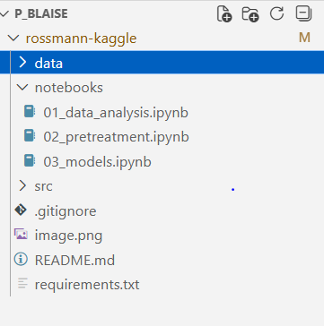
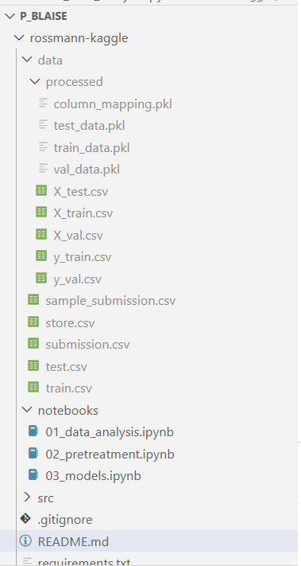

📊 Rossmann Sales Prediction – Kaggle Project

Projet réalisé dans le cadre de la compétition Kaggle – Rossmann Store Sales.

🚀 Installation du projet
1️⃣ Cloner le projet

Créer un dossier en local, puis l’ouvrir dans VS Code.

Dans le terminal :

git clone -b developer "le lien du depot "

Puis entrer dans le dossier :

cd rossmann-kaggle

2️⃣ Télécharger le dossier data

Les données ne sont pas incluses dans le repository GitHub.

Télécharger le dossier data contenant les 4 fichiers depuis Google Drive :

👉 https://drive.google.com/drive/folders/1-GpcMr1KEAeNN9Ol2BjubJ1iQWsRpJua?usp=drive_link

Une fois téléchargé :

Placer le dossier data à la racine du projet :

▶️ Exécution du projet

Une fois le dossier data ajouté :

Exécuter les notebooks ou les scripts Python.

En lançant le code :

Les fichiers de preprocessing seront générés

Les modèles seront entraînés

Le fichier submission.csv sera automatiquement créé

Ce fichier pourra ensuite être soumis sur Kaggle.

 Structure du projet
